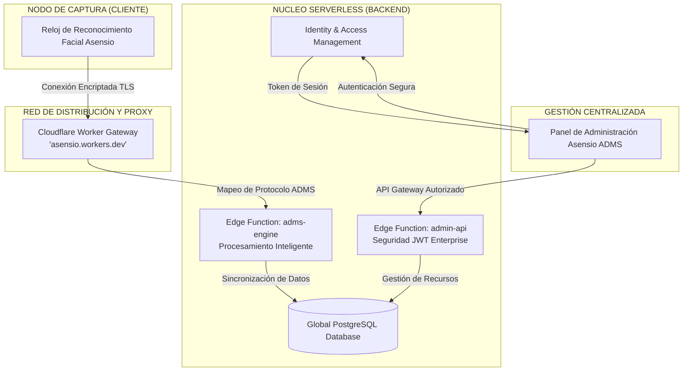

# 📊 Infografía Técnica: Ecosistema Asensio ADMS Serverless

Esta infografía resume la arquitectura moderna y de alta disponibilidad de la solución **Asensio ADMS**.

---

## 🏗️ Mapa de la Infraestructura Global

---

## 💎 Componentes de Tecnología Superior

| Componente | Función Estratégica | Ventaja Competitiva |
| :--- | :--- | :--- |
| **Relojes Asensio** | Captura biométrica de última generación (Facial/Palma). | Disponibles en [asensiosistemas.net](https://asensiosistemas.net) y compatibles con tecnología de punta (Granding). |
| **Edge Functions** | Ejecución de lógica en el borde de la red. | Latencia mínima y escalabilidad automática sin servidores físicos. |
| **Arquitectura Serverless** | Nube distribuida de Supabase. | Disponibilidad del 99.9% con costos optimizados por transacción. |
| **Seguridad JWT** | Protección de datos grado bancario. | Validación de identidad en cada petición administrativa. |

---

## 🔒 Modelo de Seguridad Avanzado

> [!IMPORTANT]
> **Defensa Multicapa (Security by Design)**
> - **Smart Terminals**: Comunicación dedicada hacia los motores de procesamiento `adms-engine`.
> - **Control de Acceso**: Panel administrativo protegido con autenticación de doble factor a través de Supabase Auth.
> - **Integridad de Datos**: Protocolo ADMS adaptado para máxima fiabilidad en redes inestables.

---

## ⏱️ Ciclo de Vida Operativo

1. **Implementación**: Configuración de los Relojes Asensio hacia el Gateway Inteligente.
2. **Activación**: Handshake automático y autorización centralizada desde el panel.
3. **Monitoreo**: Visualización en tiempo real de fichas, diagnósticos y estado del hardware.
4. **Respaldo**: Almacenamiento redundante en PostgreSQL con backups automáticos.

---
> [!TIP]
> **Soporte y Hardware**: Para adquirir nuevos equipos o soporte técnico oficial, visite [asensiosistemas.net](https://asensiosistemas.net).
